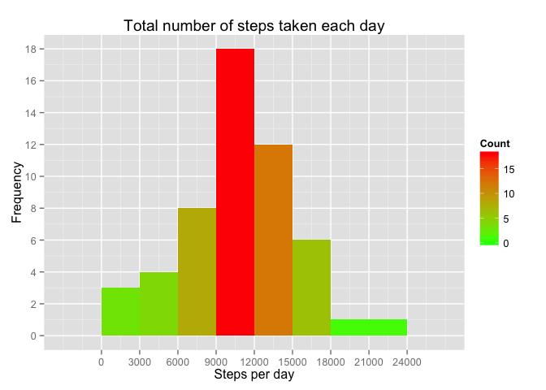
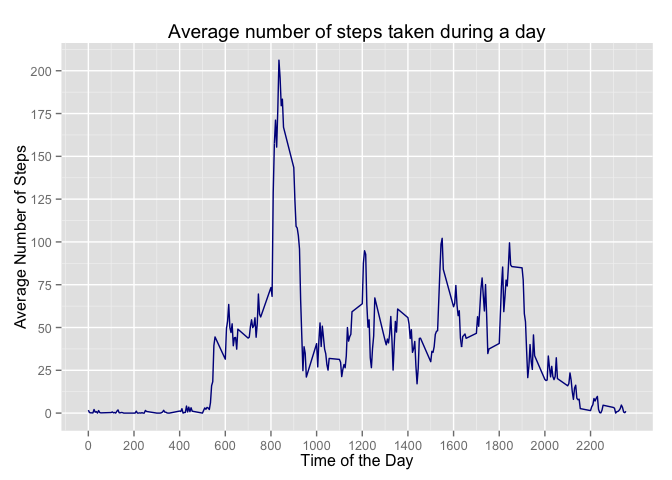
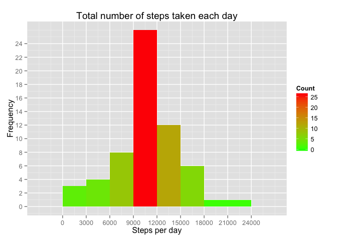
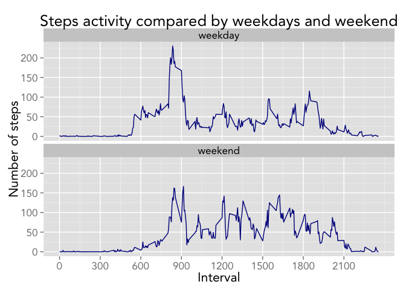

# Reproducible Research: Peer Assessment 1
## Style Guide remarks
I decide to stick with google style guide for R  
<https://google-styleguide.googlecode.com/svn/trunk/Rguide.xml>  
This is why i am chosing variable names like ```some.variable.name```

## Import libraries that will be used in this script


```r
library(dplyr)
library(ggplot2)
```
## Loading and preprocessing the data
unzip and load the data into activity variable

```r
unzip("activity.zip")
activity <- read.csv("activity.csv")
```

## What is mean total number of steps taken per day?
Remove NAs from activity dataframe, grouping activity data by date,  
making an aggregated view of activity data, showing total number of steps per day  

```r
activity.by.day <- tbl_df(na.omit(activity)) %>%
    group_by(date) %>%
    summarise(steps.per.day = sum(steps))
```
Build the histogram using ggplot  

```r
hist <- ggplot(activity.by.day, aes(x=steps.per.day))
hist + geom_histogram(aes(fill = ..count..), binwidth = 3000) +
    scale_fill_gradient("Count", low = "green", high = "red") +
    scale_x_continuous(breaks=seq(0, 25000, 3000)) +
    scale_y_continuous(breaks=seq(0, 25, 2)) +
    ggtitle("Total number of steps taken each day") +
    ylab("Frequency") + xlab("Steps per day")
```

 

Calculating the mean and the median of the total number of steps taken per day  

```r
#disable scientific notation and show only 2 significant digits
options(scipen = 999, digits = 2)
steps.mean <- mean(activity.by.day$steps.per.day)
steps.median <- median(activity.by.day$steps.per.day)
```
- The **mean** of the total number of steps taken per day is *10766.19*  
- The **median** of the total number of steps taken per day is *10765*  

## What is the average daily activity pattern?
To see an average daily pattern we should aggregate data by intervals

```r
activity.by.interval <- tbl_df(na.omit(activity)) %>%
    group_by(interval) %>%
    summarise(steps.per.interval = mean(steps))
```
Build the plot

```r
plot <- ggplot(activity.by.interval, aes(x=interval, y=steps.per.interval))
plot + geom_line(colour = "darkblue") +
    scale_x_continuous(breaks=seq(0, 2355, 200)) +
    scale_y_continuous(breaks=seq(0, 250, 25)) +
    ggtitle("Average number of steps taken during a day") +
    ylab("Average Number of Steps") + xlab("Time of the Day")
```

 

From the graph one can be seen that the subject is resting from 00:00 untill 05:00,  
after that we can see the number of steps increasing with a peak at around 08:30,  
followed by smaller peaks at 1200 and around 1530 and 1830,  
after that the number of steps is decreasing until 2200 or 2300.  

#### Calculation for getting 5-min interval which in average has the maximum number of steps 

```r
max.steps.index <- which.max(activity.by.interval$steps.per.interval)
max.steps.interval <- activity.by.interval[max.steps.index, "interval"]
max.steps.value <- activity.by.interval[max.steps.index, "steps.per.interval"]
```
Calculations show that **maximum number of steps on average** is *206.17*  
and the **interval** when it occurs is *835*  

## Imputing missing values
Calculate the total number of missing values in the dataset  

```r
na <-sum(is.na(activity))
print(na)
```

```
## [1] 2304
```

So there are *2304* missing values.

To make an approach how to replace these NAs with some values we need to consider next thing.  
The number of steps can be either 0 or 1 or any other integer value,  
so we need to be able to replace NAs with integers and not mean values.  
So for example if the mean is 0.33 that would mean we need to replace all NAs  
with 0 which is not very correct and changes the result.  
So i will be using a flip coin model with probability vector set to return either  
the floor(mean) or ceiling(mean) with corresponding probabilities

I will use next strategy for filling NAs values steps:

- calculate the mean for a specific interval  
- calculate the sum of all NAs for a specific interval  
- build a binomial distribution and get a vector with length equal to missing NAs 
number for that interval  
- replace NAs with vector obtained from the binomial disrtibution  

Creating the function that will generate a vector of values with specified parameters  


```r
GetReplaceValues <- function(mean, na.count) {
    #   setting seed to make results reproducible
    set.seed(121)
    first.value <- floor(mean)
    second.value <- ceiling(mean)
    prob1 <- second.value - mean
    prob2 <- 1 - prob1
    if (prob1 - prob2 != 0){
        values <- sample(c(first.value, second.value),
                     size=na.count, replace=TRUE,
                     prob=c(prob1, prob2))
    } else {
        values <- sample(c(first.value, 0),
                     size=na.count, replace=TRUE,
                     prob=c(prob1, 0))
    }
    return(values)
}
```

Define a function to actually replace the NA values in a dataframe for a specific interval,
function returns a dataframe with NAs replaced

```r
ReplaceNas <- function(dframe, dframe.by.interval, period){
    mean.value <- filter(dframe.by.interval, interval == period)[["steps.per.interval"]]
    na.index <- which(dframe$interval == period & is.na(dframe$steps))
    na.count <- length(na.index)
    values.vector <- GetReplaceValues(mean.value, na.count)
    i <- 1
    for (index in na.index) {
        dframe[index, "steps"] <- values.vector[i]
        i <- i + 1
    }
    return(dframe)
}
```
Now we will cycle over all 5 min intervals and update the NAs with set of calculated values  

```r
intervals <- activity.by.interval[[1]]
# create a copy of activity dataframe
completed.activity <- activity
for (inter in intervals) {
    completed.activity <- ReplaceNas(completed.activity,
                                     activity.by.interval,
                                     as.character(inter))
}
```

ensuring there are no more NAs  

```r
summary(completed.activity)
```

```
##      steps             date          interval   
##  Min.   :  0   2012-10-01:  288   Min.   :   0  
##  1st Qu.:  0   2012-10-02:  288   1st Qu.: 589  
##  Median :  0   2012-10-03:  288   Median :1178  
##  Mean   : 37   2012-10-04:  288   Mean   :1178  
##  3rd Qu.: 27   2012-10-05:  288   3rd Qu.:1766  
##  Max.   :806   2012-10-06:  288   Max.   :2355  
##                (Other)   :15840
```
Build the histogram with "completed" activity data  
first lets group the data

```r
completed.activity.by.day <- tbl_df(na.omit(completed.activity)) %>%
    group_by(date) %>%
    summarise(steps.per.day = sum(steps))
```
Then build the histogram  

```r
hist <- ggplot(completed.activity.by.day, aes(x=steps.per.day))
hist + geom_histogram(aes(fill = ..count..), binwidth = 3000) +
    scale_fill_gradient("Count", low = "green", high = "red") +
    scale_x_continuous(breaks=seq(0, 25000, 3000)) +
    scale_y_continuous(breaks=seq(0, 25, 2)) +
    ggtitle("Total number of steps taken each day") +
    ylab("Frequency") + xlab("Steps per day")
```

 

Once again calculating the mean and the median of the total number of steps 
done in a day by using the "completed" activity set  

```r
#disable scientific notation and show only 2 significant digits
options(scipen = 999, digits = 2)
steps.mean <- mean(completed.activity.by.day$steps.per.day)
steps.median <- median(completed.activity.by.day$steps.per.day)
```
- The **mean** of the total number of steps taken per day is *10766.13*  
- The **median** of the total number of steps taken per day is *10762*  

compared to previous set containing NAs  

- The **mean** of the total number of steps taken per day is *10766.19*  
- The **median** of the total number of steps taken per day is *10765* 

So after choosing above mentioned approach:
- The histogram changed quite a bit, mostly for the number of steps between
9000 and 12000
- The mean did not change and median is slightly lower compared to activity data that contained NAs

So the impact can be noticed only by looking at the histogram,  
for the number of days taken per day and mostly in the interval that is close to the  
mean and the average

## Are there differences in activity patterns between weekdays and weekends?

Create a new factor variable in the dataset with two levels – "weekday" and "weekend"

```r
# helper function to return either a "weekday" or a "weekend" based on input date
GetDay <- function(date) {
    if (weekdays(as.Date(date)) == "Sunday" | weekdays(as.Date(date)) == "Saturday") {
        "weekend"
    } else {
        "weekday"
    }
}    
# create a new factor variable using sapply and helper function
completed.activity["day"] <- factor(sapply(completed.activity$date, GetDay))
```

Group the data by interval and day, and calculate the mean of steps  

```r
avg.steps.by.day <- tbl_df(completed.activity) %>%
    group_by(interval, day) %>%
    summarize(steps = mean(steps))

plot <- ggplot(data = avg.steps.by.day)
    plot + geom_line(aes(x = interval, y = steps), colour = "darkblue") +
    facet_wrap( ~ day, ncol=1) +
    scale_x_continuous(breaks=seq(0, 2355, 300)) +
    xlab("Interval") + ylab("Number of steps") +
    theme_gray(base_family = "Avenir", base_size = 16) +
    labs(title = "Steps activity compared by weekdays and weekend")
```

 
